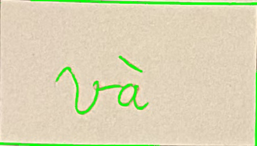
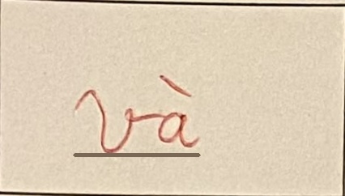
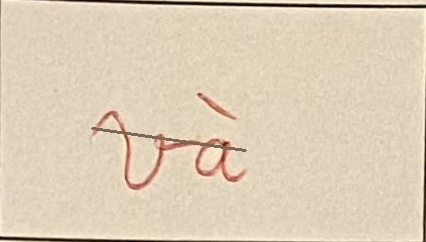
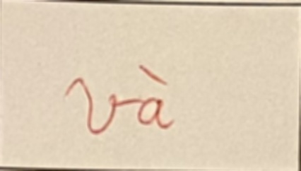
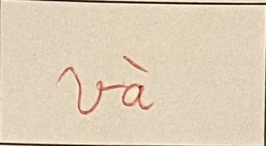
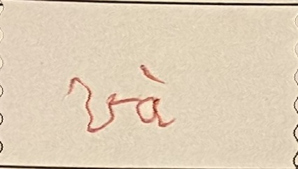
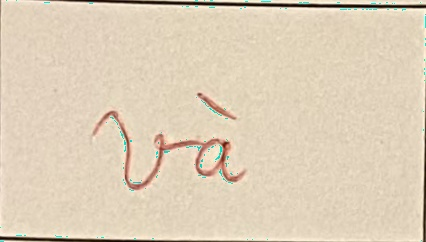
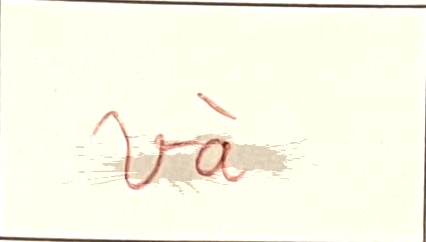

# Augment for OCR data

## Argument

- Add `--gen` argument to set the number of augment image for each original image
- Add `--origin` argument to set the path of folder contain original images
- Add `--result` argument to set the path of folder contain result images
- Add `--method` argument to set method would be used for image (Ex: `--method color bg`)
- Add `--prob` argument to set probability of each method (Ex: `--prob 0.5 0.5`)
- **NOTE:**
   without `--method`, all method would be used
   without `--prob`, all method have probability = 1

## Augment function

| Symbol    |          Function           |
| --------- | :-------------------------: |
| color     |      Change text color      |
| underline |   Draw underline in text    |
| delete    |  Draw delete line in text   |
| blur      |         Blur image          |
| stretch   |    Random stretch image     |
| distort   |    Random distort image     |
| noise     |       Gaussian noise        |
| bg        | Draw ink in random position |

## Detail

### Original image

### Color

### Underline

### Delete

### Blur

### Stretch

### Distort

### Noise

### Bg

